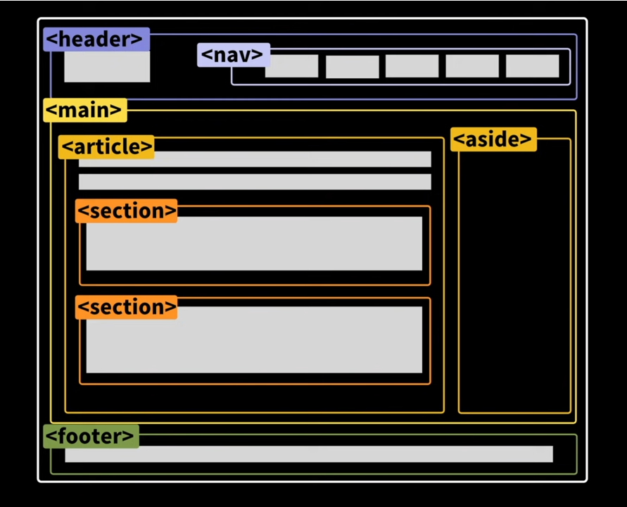

# HTML 

* **head : HTML `<head>` 요소**는 기계가 식별할 수 있는 문서 정보(메타데이터)를 담습니다. 정보로는 문서가 사용할 [제목](https://developer.mozilla.org/ko/docs/Web/HTML/Element/title), [스크립트](https://developer.mozilla.org/ko/docs/Web/HTML/Element/script), [스타일 시트](https://developer.mozilla.org/ko/docs/Web/HTML/Element/style) 등이 있습니다.

* **h1~h6: **6단계의 구획 제목을 나타냅니다

  * h1~ 순차적으로사용한다

* **p:** 문단을 넣을떄 활용한다

* **br:** 줄바꿈 요소

* **i**:시각적으로만 이탤릭체

* **em:** 강조하는 이탤릭체 **(스크린 리더사용시 강조됨)**

* **b**: 시각적으로만 볼드체

* **strong:** 강조하는문장 ,  굵은 글씨로 표시 **(스크린 리더사용시 강조됨)**

* **a:** 다른웹사이트로 가는  링크를 걸어준다 **(사용자가 어디론가이동할때 사용)**

* **img**: 문서에 이미지를 넣는다

  * `src` 특성은 **필수**이며, 포함하고자 하는 이미지로의 경로를 지정합니다
  * `alt` 특성은 이미지의 텍스트 설명이며 필수는 아니지만, 스크린 리더가 `alt`의 값을 읽어 사용자에게 이미지를 설명하므로, 접근성 차원에서 **매우 유용**합니다. 또한 네트워크 오류, 콘텐츠 차단, 죽은 링크 등 이미지를 표시할 수 없는 경우에도 이 속성의 값을 대신 보여줍니다.

* **input:**  웹 기반 양식에서 사용자의 데이터를 받을 수 있는 대화형 컨트롤을 생성합니다

  * button = 기본 행동을 가지지 않으며 [`value`](https://developer.mozilla.org/ko/docs/Web/HTML/Element/Input#attr-value)을 레이블로 사용하는 푸시 버튼
  * date = 날짜(연월일, 시간 없음)를 지정할 수 있는 컨트롤. 브라우저가 지원하는 경우, 활성화 시 날짜를 선택할 수 있는 달력 등을 열어줍니다.
  * submit (en-US) = 양식을 전송하는 버튼
  * reset (en-US) =  양식의 내용을 디폴트값(기본값)으로 초기화하는 버튼. 권장되지 않습니다.

* **div** :  [CSS](https://developer.mozilla.org/ko/docs/Glossary/CSS)로 꾸미기 전에는 콘텐츠나 레이아웃에 어  떤 영향도 주지 않습니다.

  * div  요소는 의미를 가진 다른 요소 (`article`,`nav`)등  적절하지 않을 때만 사용해야 합니다.

  * [`class`](https://developer.mozilla.org/ko/docs/Web/HTML/Global_attributes#attr-class) 속성을통해 사용할수있다

* **article**: 독립적으로 고유한 정보를 나타낼때 사용할수있다

  * 하나의 문서가 여러 개의 `<article>`을 가질 수 있습니다. 예컨대 사용자가 스크롤하면 계속해서 다음 글을 보여주는 블로그의 경우, 각각의 글이 `<article>` 요소가 되며, 그 안에는 또 여러 개의 `section`이 존재할 수 있습니다.

* **section**:  연관있는 내용을 묶어줄때 사용할수있다

* **nav:** 문서의 부분 중 현재 페이지 내, 또는 다른 페이지로의 링크를 보여주는 구획

  * 문서의 모든 링크가 `<nav>`요소 안에 있을 필요는 없습니다. `<nav>` 요소는 주요 탐색 링크 블록을 위한 요소입니다. 대개 `<footer>`에 들어가지 않아도 되는 링크를 포함합니다.
  * `<nav>` 하나는 사이트 전체 탐색, 다른 하나는 현재 페이지 내 탐색으로 사용하는 등, 하나의 문서에서 여러 개의 `nav` 태그를 가질 수 있습니다. 이럴 때 `aria-labelledby`를 사용해 접근성을 향상할 수 있습니다.
  * 스크린 리더 등 장애를 가진 사용자를 위한 사용자 에이전트는 최초 렌더링에서 탐색 전용 콘텐츠를 제외할지 결정할 때 `<nav>`를 참고합니다.

  

# 웹 접근성 경험하고 느낀 점 

내가 편하게 할수있는 일들이 남들에게는 어려운일 일수도 있는걸 알게됐다.

정말 좋말 좋은시간이었고,

누구든 사용할수 있는걸 만들고싶다. 

